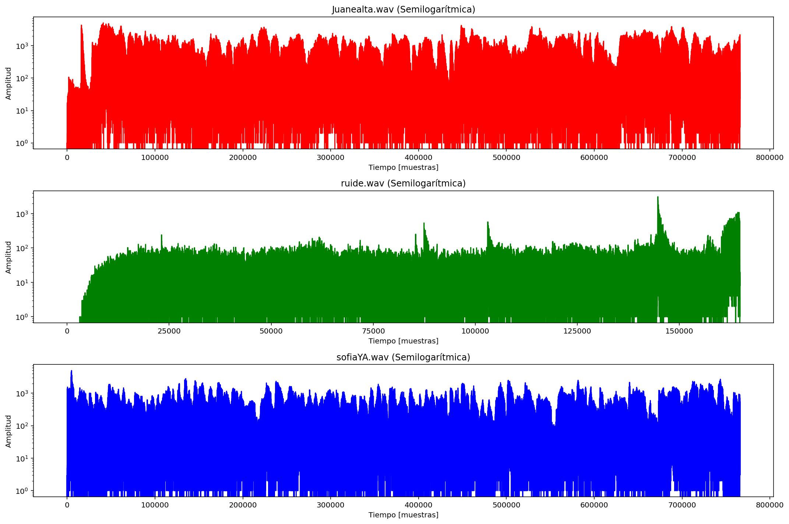

# lab-3: Problema del coctel 

## Descripción
Con el objetivo de aplicar el análisis en frecuencia de señales de voz en un problema de captura mezclada, se realizó una práctica que simulara esta problemática, utilizando el método del “cóctel”, se tomó la grabación de dos micrófonos diferentes durante una conversación de dos personas hablando de temas totalmente diferentes al tiempo, de modo que se buscó aislar una señal de voz específica a partir de un entorno expuesto al ruido del ambiente aunque la toma haya sido grabada en un laboratorio insonorizado, el hecho de que se capturaran dos señales al tiempo provoca la relación señal /ruido que fue calculada con el fin de asegurar la calidad de la grabación.
De igual manera se investigaron e implementaron técnicas de separación de fuentes como el análisis de componentes independientes o beamforming para garantizar que se aislara la señal de interés. 

## Desarrollo
### Adquicisión de los datos
Después de tener grabados los audios que se encuentran en el presente repositorio, hicimos uso de una librería especial “scipy.io.wavfile” la cuál nos permite traer los audios de tipo “wav” y usar toda la información de ellos. 
Primeramente para traerlos al entorno de programación de “Spyder” usamos la función “waves.read()” la cuál tiene como parámetro el nombre del archivo que se desea leer y los da los datos y el muestreo. A continuación se muestra la línea del código respectiva. 

    archivo1 = 'Juanealta.wav';
    muestreo1, sonido1 = waves.read(archivo1)
    
    archivo2 = 'ruide.wav';
    muestreo2, sonido2 = waves.read(archivo2)
    
    archivo3 = 'sofiaYA.wav';
    muestreo3, sonido3 = waves.read(archivo3)
Para poder trabajar con los audios obtenidos y grabados en el laboratorio de diseño y simulación dentro de la universidad militar nueva granada, ya que es una sala completamente insonorizada que asegura que el ruido existente en los audios sean lo menores posible, es necesario hacerle unos ajustes especiales a los audios como asegurarse que tengan la misma duración, misma cantidad de muestras tomadas entre otras cosas. Una vez realizados los respectivos ajustes, se grafican estos datos por medio de las siguientes líneas de código.

        # Graficar señales
        plt.figure(figsize=(15, 10))
        
        plt.subplot(3, 1, 1)
        plt.semilogy(np.abs(sonido1), color='red')
        plt.title(f"{archivo1} (Semilogarítmica)")
        plt.xlabel("Tiempo [muestras]")
        plt.ylabel("Amplitud")
        
        plt.subplot(3, 1, 2)
        plt.semilogy(np.abs(sonido2), color='green')
        plt.title(f"{archivo2} (Semilogarítmica)")
        plt.xlabel("Tiempo [muestras]")
        plt.ylabel("Amplitud")
        
        plt.subplot(3, 1, 3)
        plt.semilogy(np.abs(sonido3), color='blue')
        plt.title(f"{archivo3} (Semilogarítmica)")
        plt.xlabel("Tiempo [muestras]")
        plt.ylabel("Amplitud")
        
        plt.tight_layout()
        plt.show()

### SNR
La relación entre el ruido y la señal normal es calculada por medio del siguiente código y es importante en el laboratorio ya que si el resultado nos muestra mucho más ruido que la señal, se va a dificultar bastante esa filtración de una de las voces que se escuchen. Para poder seguir a hacer los filtros y escuchar las voces individuales, se requiere por lo menos que los SNR sean como mínimo un 10, en caso de no pasar, tica repetir los audios. 

        potJuane = np.sum(sonido1**2) / len(sonido1)
        potSofia = np.sum(sonido3**2) / len(sonido3)
        potRuido = np.sum(sonido2**2) / len(sonido2)
        SNR1 = 10*np.log10(potJuane/potRuido)
        SNR2 = 10*np.log10(potSofia/potRuido)
        
        print(f"Potencia de audio Juane: {potJuane:.4f}")
        print(f"Potencia de audio sofiaYA: {potSofia:.4f}")
        print(f"Potencia de ruido: {potRuido:.4f}")
        
        print(f"SNR de audio juane: {SNR1:.4f}")
        print(f"SNR de audio sofiaYA: {SNR2:.4f}")
        
        #Resultados en el terminal Python
        Potencia de audio Juane: 470273.9062
        Potencia de audio sofiaYA: 140361.2344
        Potencia de ruido: 6809.4594
        SNR de audio juane: 18.3924
        SNR de audio sofiaYA: 13.1413

### Transformada de Fourier
Análisis temporal: 
Para poder visualizar las señales en el dominio del tiempo, determinando cómo varía la amplitud de la señal en un rango de tiempo, se utilizó la función: “plt.semiology()” la cual permite graficar los datos tomados en una escala logarítmica en el eje y y lineal en el eje x, como se muestra a continuación:
     plt.subplot(3, 1, 1)
     plt.semilogy(np.abs(sonido1), color='red')
     plt.title(f"{archivo1} (Semilogarítmica)")
     plt.xlabel("Tiempo [muestras]")
     plt.ylabel("Amplitud")
El fin de la escala semilogarítmica es resaltar las variaciones de la amplitud. 

Análisis espectral:
Para poder visualizar las señales en el dominio de la frecuencia, es decir la descomposición del análisis espectral, se aplica la transformada de fourier con la siguiente función: “np.fft.fft()”
     #Transformada de Fourier
     N1 = len(sonido1)
     frecuencia1 = np.fft.fftfreq(N1, 1/muestreo1)
     fft1 = np.fft.fft(sonido1)
     magnitud1 = np.abs(fft1)
     N2 = len(sonido2)
     frecuencia2 = np.fft.fftfreq(N2, 1/muestreo2)
     fft2 = np.fft.fft(sonido2)
     magnitud2 = np.abs(fft2)

     N3 = len(sonido3)
     frecuencia3 = np.fft.fftfreq(N3, 1/muestreo3)
     fft3 = np.fft.fft(sonido3)
     magnitud3 = np.abs(fft3)

La función “ffn=np.fft.fft()” cumple la función de convertir la señal del dominio del tiempo a la frecuencia, descomponiendo por medio de la transformada rápida de fourier la señal en sus componentes sinusoidales en distintas frecuencias, incluyendo una respuesta que describe la magnitud y la fase. 

La función “frecuenciax = np.fft.fftfreq(N1, 1/muestreox)” cumple la función de generar las frecuencias en un eje, asignando frecuencias con números reales a cada punto de la transformada, y por consiguiente, la parte “1/muestreox” asigna el tiempo entre las muestras, para calcular de tal manera la escala de la frecuencia. 

La función “magnitudx = np.abs(fftx)” cumple la función de extraer los valores de la magnitud eliminando de tal manera la fase, ya que como la transformada rápida de fourier genera valores complejos, “np.abs” asigna nuevamente la energía de cada frecuencia, mostrando de tal manera, cuánta energía tiene cada componente en función de la frecuencia de la señal. 

La función “plt.plot” muestra gráficamente la magnitud del espectro con respecto a la frecuencia, cumpliendo la función de visualizar qué frecuencias están presentes en la señal y demostrando su intensidad. 

### ICA

### Beamforming
La tecnología denominada “beamforming” es utilizada en comunicaciones inalámbricas para poder dirigir una señal en una dirección concreta evitando la dispersión de ésta en otras direcciones, un ejemplo de esto sería el wifi, de modo que en lugar de que se disperse en un espacio irá directamente al dispositivo que esté conectado, esta tecnología se basa en combinar señales capturadas por diferentes micrófonos para lograr el enfoque en una dirección específica; en el código se incrementa de la siguiente manera: 

     #Beamforming con un retardo de ejemplo (10 muestras)
     d = 2.5  # Distancia en metros
     v = 343  # Velocidad del sonido en m/s
     fs = muestreo1  # Frecuencia de muestreo

     delay_samples = int((d * fs) / v)
     print(f"Retardo calculado: {delay_samples} muestras")

     sonido3_delayed = np.roll(sonido3, delay_samples)
     beamforming_resultado = (sonido1 + sonido3_delayed) / 2

Primero se determina el tiempo de de llegada de la señal entre los dos micrófonos separados por una distancia de 2.5 metros: “d = 2.5 # Distancia entre micrófonos en metros”, para calcular el tiempo que tarda el sonido en recorrer la distancia establecida se utiliza la función “(d/v)” con la velocidad determinada, para luego convertirla en muestras en la señal multiplicándose por “fs”.

La función “sonido3_delayed = np.roll(sonido3, delay_samples)” cumple la función de desplazar la señal para poder simular que la señal captada por el segundo micrófono llegará con un retraso.

Ahora, por último en esta parte del código se implementa la función “beamforming_resultado = (sonido1 + sonido3_delayed) / 2” la cual busca hallar el promedio entre las dos señales luego de que sean alineadas en el tiempo de modo que según el principio del beamforming, reforzará las señales que provienen de la misma dirección con el fin de construirlas, y cancela el ruido de las señales fuera de fase la cual es una función “destructiva”; para por último graficarla por medio de la parte del código: 
     plt.subplot(3, 1, 3)
     plt.plot(beamforming_resultado, label="Señal Filtrada por Beamforming", color="C2")
     plt.title("Resultado de Beamforming por Delay-and-Sum")
     plt.xlabel("Tiempo [muestras]")
     plt.ylabel("Amplitud")
     plt.legend()

     plt.tight_layout()
     plt.show()
Para por último reproducir el audio que se obtiene como resultado del filtrado, para evaluar la mejora de la señal perceptible:
     # Voces por Beamforming
     print("Reproduciendo señal filtrada por Beamforming...")
     sd.play(beamforming_resultado, muestreo1)
     sd.wait()
La función “sd.play()” será la responsable de que se pueda reproducir el audio resultante después del beamforming, y el muestreo corresponde a la frecuencia del muestreo digital. 

## REQUERIMIENTOS
- Python 3.11
- Spyder 6.0
- Librerias como: wfdb, matplotlib, numpy, scipy.io.wavfile, sklearn.decomposition, sounddevice
## REFERENCIAS
[1] ¿Qué es Beamforming? (2025, 4 febrero). https://www.lowi.es/glosario/beamforming/ 

[2] 

[3]  
## AUTORES
- Juan Diego Clavijo Fuentes
  est.juan.dclavijjo@unimilitar.edu.co
- Sofia Olivella Moreno
  est.sofia.olivella@unimilitar.edu.co
